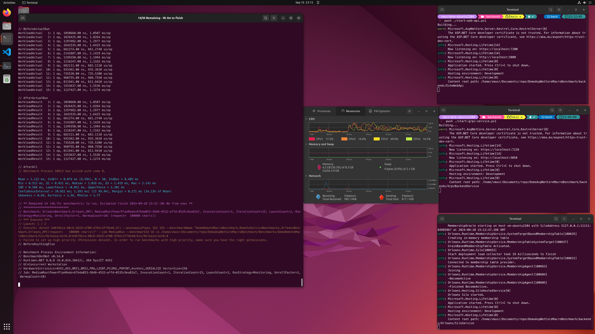

# Using BenchmarkDotNet for ASP.NET Core (REST API/gRPC/Microsoft Orleans) marco benchmark

This repository contains a macro benchmark project for measure ASP.NET Core [REST Web API](https://dotnet.microsoft.com/en-us/apps/aspnet/apis), [gRPC](https://learn.microsoft.com/en-us/aspnet/core/grpc/) and [Microsoft Orleans](https://learn.microsoft.com/en-us/dotnet/orleans/) data transfer object serialization/ de-serialization performance.



## How to run benchmark(s)

To run the benchmark, you need to have the [.NET 8 SDK](https://dotnet.microsoft.com/en-us/download/dotnet/8.0) installed.

1. Go to the **_backends_** folder and run the three PowerShell scripts (`start-web-api.ps1`, `start-grpc-service.ps1`, `start-orleans-silo.ps1`) on each terminal to start the REST API, gRPC and Orleans backends respectively.
2. Go to the **_Benchmarks/DemoRemoteMacroBenchmark_** folder and execute dotnet run command:
   * Run all benchmarks:
  
   ```sh
   dotnet run -c Release -- -f '*'
   ```
  
   The demo benchmark results will like the [screen shot image](./pics/UbuntuVM_benchmark_results.png).  
   Also these benchmarks can be run separately:
   * Run only the REST API benchmarks:
  
   ```sh
   dotnet run -c Release -- -f '*REST*'
   ```

   * Run only the gRPC benchmarks:
  
   ```sh
   dotnet run -c Release -- -f '*Grpc*'
   ```

   * Run only the Microsoft Orleans benchmarks:
  
   ```sh
   dotnet run -c Release -- -f '*Orleans*'
   ```
